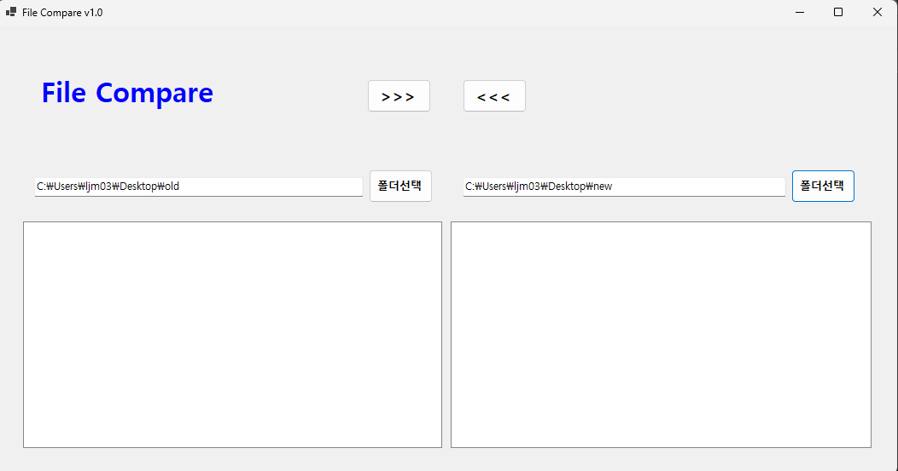
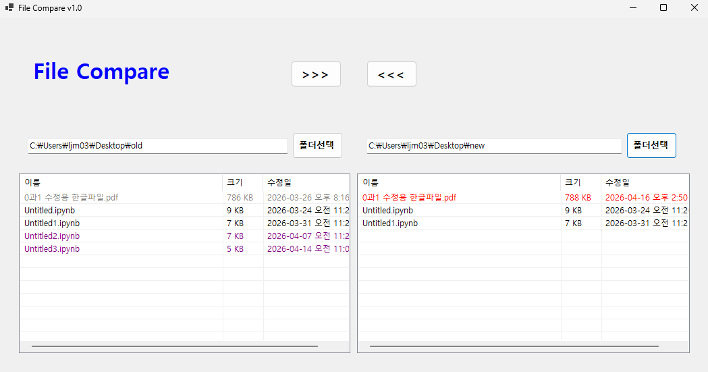
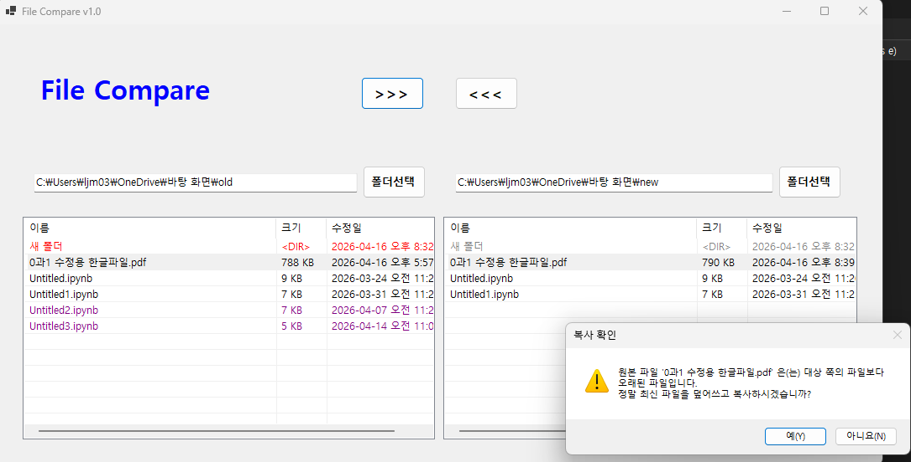
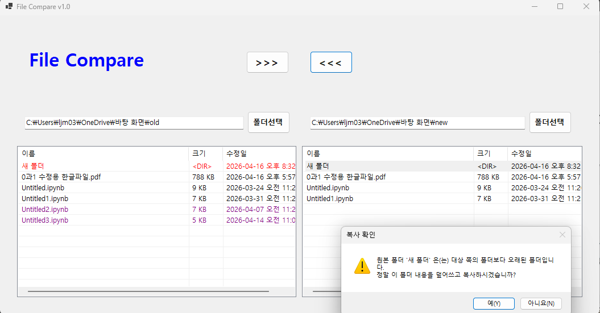

# (C# 코딩) 파일비교 프로그램

## 개요-C# 프로그래밍학습-1줄소개: 버튼을 클릭해 파일을 선택하면, 선택한 파일의 내용을 ListBox에 표시,복사,붙여넣기 기능을 제공하는 파일비교 프로그램입니다.
-사용한플랫폼: -C#, .NET Windows Forms, Visual Studio, GitHub
-사용한컨트롤:-Label, TextBox,SplitContainer, Button,Panel,ListView
-사용한기술과구현한기능:
-Visual Studio를이용하여UI 디자인
-Dock 기능을 이용하여 패널 위치 이동
-Anchor 기능을 이용하여 컨트롤 크기 조절
-파일을 비교하여 다른 파일과의 차이점을 색깔로 표시하는 기능 구현
-파일을 선택하여 복사, 붙여넣기 기능 구현
-복사하는 파일이 대상 파일보다 과거 파일일경우 경고메시지 표시 기능 구현
-하위 폴더도 파일처럼 비교하는 기능 구현

## 실행화면(과제1)
-코드의실행스크린샷과구현내용설명

-구현한내용(위그림참조)
-UI 구성: Label(앱이름표시), TextBox2개(파일 경로), Button(파일 선택), Panel(버튼 위치), ListView(파일 내용 표시)
-속성 : Dock, Anchor를 이용하여 컨트롤 위치와 크기 조절
-이벤트핸들러: Button 클릭 이벤트를 통해 파일 선택 대화상자를 열고, 선택한 파일의 경로를 TextBox에 표시
-컨트롤에서 기본적으로 제공하는 기능 구동 확인(파일 선택, 내용 표시)

## 실행화면(과제2)
-코드의실행스크린샷과구현내용설명

-구현한내용(위그림참조)
-폴더 선택 후 파일 선택기능 추가 
-파일 비교 기능 구현:두 파일의 내용을 비교하여 다른 부분을 색깔로 표시하는 기능 추가
-양쪽폴더의파일표시: ListView를 이용하여 양쪽 폴더의 파일을 표시하는 기능 추가
-리스트뷰의 속성: ListView의 View 속성을 Details로 설정하여 파일 이름과 크기 등의 정보를 표시

## 실행화면(과제3)
-코드의실행스크린샷과구현내용설명

-구현한내용(위그림참조)
-파일 복사 및 붙여넣기 기능 구현: 선택한 파일을 다른 위치로 복사하거나 붙여넣는 기능 추가
-복사하는 파일이 대상 파일보다 과거 파일일 경우 경고 메시지 표시 기능 구현: 복사하려는 파일이 대상 파일보다 오래된 경우 사용자에게 경고 메시지를 표시하는 기능 추가
단 복사하려는 파일이 과거 파일보다 미래인 경우에는 별도 메시지 없이 복사 진행
-복사 완료 후에는 다시 파일 비교를 수행하여 변경된 내용을 반영하는 기능 추가 = 색깔로 표시된 부분이 업데이트되어 최신 상태를 유지하도록 구현

## 실행화면(과제4)
-코드의실행스크린샷과구현내용설명

-구현한내용(위그림참조)
-하위 폴더도 파일처럼 비교하는 기능 구현= 선택한 폴더 내의 하위 폴더도 포함하여 파일 비교를 수행하는 기능 추가
-하위 폴더의 파일도 ListView에 표시하여 사용자가 쉽게 비교할 수 있도록 구현
-하위 폴더의 파일 비교 결과도 색깔로 표시하여 다른 부분을 쉽게 식별할 수 있도록 구현
-하위 폴더의 파일 복사 및 붙여넣기 기능 구현: 하위 폴더의 파일도 선택하여 복사하거나 붙여넣는 기능 추가
-복사하려는 파일이 대상 파일보다 과거인 경우 경고 메시지 표시 기능도 하위 폴더의 파일에 적용하여 사용자에게 일관된 경험 제공
-복사 완료 후에는 하위 폴더의 파일 비교 결과도 업데이트하여 최신 상태를 유지하도록 구현
